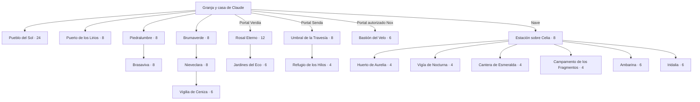

# Planeación de todos los pueblos y mundos

## Domicilios del primer pueblo integrados

El 10 de octubre de 2026 se conectan 17 viviendas para los 24 vecinos: siete interiores anexos a comercios y diez casas nuevas en barrios norte y sur. Entrada cercana a la puerta, horarios, teclado, conversación/regalos en casa, salida y persistencia; rutinas regresan al domicilio asignado. [VIVIENDAS-INTEGRACION.md](VIVIENDAS-INTEGRACION.md) documenta reparto, API, pruebas y límites. Los interiores son básicos y compartidos; se conectan 24 dormitorios privados básicos; faltan restauración, personalización y viviendas de los demás pueblos.

Actualizado: 10 de octubre de 2026. Propuesta de **19 núcleos habitados, 142 interlocutores y 76 unidades de alojamiento**, además de cinco figuras narrativas. Una unidad puede ser casa, habitaciones de posada o módulo de base; no representa necesariamente una familia. Se trabaja sobre granja-v3 y guardado V5.

[Listado completo con todos los nombres y oficios](REPARTO-COMPLETO.md) · [Datos e IDs](REPARTO-MUNDOS.json)

## Núcleos y población

| Región | Núcleo | Tipo | Habitantes | Alojamientos |
|---|---|---|---|---|
| Celia · Santuario Protegido | Pueblo del Sol | pueblo | 24 | 17 |
| Celia · Santuario Protegido | Puerto de los Lirios | pueblo | 8 | 4 |
| Celia · Santuario Protegido | Brumaverde | pueblo | 8 | 4 |
| Celia · Santuario Protegido | Piedralumbre | pueblo | 8 | 4 |
| Celia · Santuario Protegido | Brasaviva | pueblo | 8 | 4 |
| Celia · Santuario Protegido | Nieveclara | pueblo | 8 | 4 |
| Ceniza y Sangre · Fronteras de Astra | Vigilia de Ceniza | campamento | 6 | 3 |
| Verdia | Rosal Eterno | pueblo de cuidadores | 12 | 6 |
| Verdia | Jardines del Eco | aldea de cuidadores | 6 | 3 |
| Senda | Umbral de la Travesía | refugio | 8 | 4 |
| Senda | Refugio de los Hilos | refugio | 4 | 2 |
| Nox | Bastión del Velo | puesto de frontera | 6 | 3 |
| Astra · espacio | Estación sobre Celia | estacion | 8 | 4 |
| Astra · espacio | Huerto de Aurelia | puesto lunar | 4 | 2 |
| Astra · espacio | Vigía de Nocturna | puesto lunar | 4 | 2 |
| Astra · espacio | Cantera de Esmeralda | puesto lunar | 4 | 2 |
| Astra · espacio | Campamento de los Fragmentos | campamento asteroides | 4 | 2 |
| Astra · espacio | Ambarina | colonia planetaria | 6 | 3 |
| Astra · espacio | Iridalia | colonia planetaria | 6 | 3 |

La granja y la casa son lugares del jugador, con cero residentes NPC adicionales en este reparto. Bosque, lago, ruinas, galerías, mazmorras y zonas hostiles pueden existir sin otro pueblo. Los dos asteroides comparten un campamento de cuatro personas, contadas una sola vez.

## Mapa de conexiones propuesto

El esquema muestra rutas y accesos; no sustituye el plano físico ni mueve al jugador por menú. Las conexiones de los pueblos nuevos se construirán conservando los caminos ya existentes.

## Reglas comunes de diseño

- 147 identidades: 142 interlocutores y aliados, más cinco figuras del lore. No sumar de nuevo a viajeros, dependientes interiores o almas que cambian de reino.
- Él y Ella son protagonistas jugables; hogar sin residentes NPC nuevos. Animales de granja y guardianes criados, monstruos genéricos, multitudes y el dispositivo de IA no cuentan como NPC nombrados.
- Todos los nombres personales nuevos, asentamientos, alojamientos y encargos son propuestas. Solo Aura, Lara, Celia, Nath’Gora y Vael’Thor proceden como figuras nombradas del lore recibido. Los títulos actuales de los 24 vecinos siguen intactos.
- Las Santas son humanas canalizadoras; no son las diosas. Lara es compasiva. Verdia es paz; Senda es purificación; Nox permanece fuera del ciclo de la vida.
- Lunas Aurelia, Nocturna y Esmeralda pertenecen al lore; sus bases y poblaciones son propuestas. No se añade un panteón ni una historia definitiva de los habitantes de Iris.
- La Constelación de los Amantes mantiene el escudo indestructible mientras brilla. La ubicación de frontera, permisos de viaje y desenlace quedan sujetos al lore posterior.
- Días, estaciones, crecimiento, edad, visitas, cumpleaños y plazos avanzan al dormir. La ausencia real no avanza historias; se conserva aparte la regla de cuidado real ya acordada.
- Amistad y convivencia, sin nuevos romances por defecto: Él y Ella conservan su relación protagonista. Viviendas compartidas no fijan parentescos ni parejas; los menores tienen actividades supervisadas.
- Ganado normal en la tienda de Mara; especialistas regionales enseñan linajes y venden suministros o planos. Nacimientos y bienestar son obligatorios para las misiones de crianza y los registros de guardianes.
- Servicios esenciales, señalamientos y regreso visibles. Movimiento entre zonas caminando; portales solo para los reinos y nave para el espacio. No abrir lugares mediante teletransporte de menú.
- La casa, Altar del Lazo Primordial y Álbum de Recuerdos los integra Claude. Esta planificación reserva eventos únicos de recompensa sin determinar objetos especiales de la casa.
- Súper Manía, Cien Puertas, El Retrete Espacial y juegos de mesa permanecen independientes de la campaña; su reparto propio lo mantiene el proyecto principal de Claude.
- Cargar geometría y simulación detallada solo del núcleo visitado. Datos globales ligeros, interiores bajo demanda y avatares con piezas compartidas; no renderizar 147 personajes a la vez.

Viviendas con entrada alcanzable, dormitorio individual, espacio compartido, oficio o patio. Servicios con horario y señal de cierre. Plaza, bancos, plantas, sonidos, escenas y rutas de ocio evitan un mundo vacío. Rutas a pie con profundidad visual, terreno natural, bordes de camino adaptados y puentes; colisiones deben permitir regreso y acceso a todas las puertas.

Arquitectura coherente con el clima: refugios de calor, abrigo de cumbre, ribera y módulos espaciales tienen requisitos propios. Presupuesto visual por núcleo y piezas compartidas, conservando el estilo actual. Los NPC y edificios comunitarios no se confunden con los edificios movibles de la granja.

## Pueblo del Sol

**Población:** 24 · **Tipo:** pueblo · **Alojamientos:** 17 · **Estado:** base actual con ampliacion planificada.

**Acceso:** Desde el inicio, caminando por el sendero este de la granja; mantener las nueve puertas actuales.

**Distribución y ambiente:** Conservar plaza descentrada, molino, canal y dos puentes. Norte: altares y clínica. Centro: mercado y plaza. Este: talleres y posada. Ampliar hacia barrios con huerto, escuela y observatorio; no colocar casas sobre las colisiones actuales.

**Servicios y espacios:** Mercado de la Semilla, Casa de los Animales, Taller del Roble, Forja del Arroyo, Clínica del Jardín, Posada del Molino, Casa de los Oficios y museo, Altar del Despertar, Altar de la Calma, Muelle del Arroyo, Escuela del Valle, Huerto comunitario, Casa de los Tejidos, Observatorio de los Amantes.

**Restauración y progresión:** Recuperar viviendas, escuela, muelle y observatorio mediante encargos. Comercios básicos disponibles al empezar.

**Vida y evento:** Fiesta del Despertar Dorado y Noche del Velo y el Rosal; las fechas concretas se fijarán en el calendario jugado. Horarios de trabajo, descanso y clima se definirán sobre el calendario jugado.

**Anclaje actual del motor:** pueblo.

| Alojamiento propuesto | Ocupantes |
|---|---|
| Vivienda del Mercado | Inés |
| Casa del Corral | Mara |
| Vivienda del Roble | Olivia |
| Casa de la Forja | Bruno |
| Vivienda del Jardín | Adela |
| Habitaciones de la Posada | Rosa, Simón |
| Vivienda del Archivo | Damián |
| Casa del Despertar | Eliana |
| Casa de la Calma | Serena |
| Casa de la Ribera | Cora, Darío |
| Casa de los Senderos | Vera, Paloma |
| Casa del Huerto | Flora, Tomás, Nina, Leo |
| Dúplex de la Escuela | Alma, Lía |
| Cabaña del Guardabosques | Gael |
| Casa de los Tejidos | Renata |
| Vivienda del Observatorio | Nerea |
| Casa del Rosal | Aurelio |

## Puerto de los Lirios

**Población:** 8 · **Tipo:** pueblo · **Alojamientos:** 4 · **Estado:** planificado.

**Acceso:** Reparar el muelle con Cora; llegar andando a la otra orilla. Barca como transporte local posterior.

**Distribución y ambiente:** Norte: llegada y tablón del agua. Centro: lonja y plaza seca. Sur: muelles y estanques. Este: redes y viviendas. Casas sobre suelo firme, madera húmeda y juncos; futura conexión al delta, sin confundir agua dulce y salada.

**Servicios y espacios:** Astillero de Ribera, Lonja de los Lirios, Estanques de Junco, Faro del Delta, Taller de Redes, Huerta del Juncal.

**Restauración y progresión:** Muelle, faro fluvial y estanques deteriorados; cada reparación habilita una función.

**Vida y evento:** Feria del Lago y Noche de Faroles. Horarios de trabajo, descanso y clima se definirán sobre el calendario jugado.

**Anclaje actual del motor:** lago.

| Alojamiento propuesto | Ocupantes |
|---|---|
| Casa 01 · Puerto de los Lirios | Bastián, Olga |
| Casa 02 · Puerto de los Lirios | Maite, Julián |
| Casa 03 · Puerto de los Lirios | Belén, Teo |
| Casa 04 · Puerto de los Lirios | Dalia, Tina |

## Brumaverde

**Población:** 8 · **Tipo:** pueblo · **Alojamientos:** 4 · **Estado:** planificado.

**Acceso:** Despejar el sendero y recuperar las pasarelas con Gael; ruinas como excursión separada del barrio.

**Distribución y ambiente:** Entrada este. Plaza bajo un árbol hueco. Norte: vivero y apiario. Oeste: santuario de criaturas. Sur: talleres y casas. Raíces, claros y pasarelas; diferenciar aprovechamiento forestal de árboles guardianes.

**Servicios y espacios:** Arboreto de la Raíz, Casa de los Hongos, Apiario de Bruma, Taller de Talla, Claro de los Guardianes, Herbolario del Musgo.

**Restauración y progresión:** Pasarelas, vivero y árbol hueco; retirar residuos sin talar el árbol monumental.

**Vida y evento:** Jornada de la Semilla Ancestral y Velada de Cuentos. Horarios de trabajo, descanso y clima se definirán sobre el calendario jugado.

**Anclaje actual del motor:** bosque_ancestral; ruinas_celia.

| Alojamiento propuesto | Ocupantes |
|---|---|
| Casa 01 · Brumaverde | Silvana, Félix |
| Casa 02 · Brumaverde | Amira, Roque |
| Casa 03 · Brumaverde | Elio, Zaira |
| Casa 04 · Brumaverde | Ada, Benicio |

## Piedralumbre

**Población:** 8 · **Tipo:** pueblo · **Alojamientos:** 4 · **Estado:** planificado.

**Acceso:** Permiso de Darío y reparación del ascensor y la ventilación; viviendas en superficie.

**Distribución y ambiente:** Entrada sur. Plaza y comedor en el centro. Ascensor al norte. Laterales: forja, talleres, laboratorio y casas. Cantera, arroyo de lavado, vigas y luz ámbar; ninguna vivienda dentro de salas de combate.

**Servicios y espacios:** Oficina de Galería, Laboratorio de Vetas, Fundición, Taller de Gemas, Armería del Paso, Taller de Poleas, Comedor Minero.

**Restauración y progresión:** Ascensor, railes, bombas y señales por etapas que habilitan cotas.

**Vida y evento:** Feria de los Oficios. Horarios de trabajo, descanso y clima se definirán sobre el calendario jugado.

**Anclaje actual del motor:** mina; mina_celia.

| Alojamiento propuesto | Ocupantes |
|---|---|
| Casa 01 · Piedralumbre | Eloy, Úrsula |
| Casa 02 · Piedralumbre | Gonzalo, Petra |
| Casa 03 · Piedralumbre | Santiago, Mireya |
| Casa 04 · Piedralumbre | Hugo, Ciro |

## Brasaviva

**Población:** 8 · **Tipo:** pueblo · **Alojamientos:** 4 · **Estado:** planificado.

**Acceso:** Paso desde Piedralumbre; reparar puente de basalto, preparar equipo térmico e inspeccionar hábitat.

**Distribución y ambiente:** Entrada oeste con agua. Centro: horno y mercado. Norte: nido de dragones. Sur: bancales, baños y casas. Lava inaccesible, respiraderos señalizados, sombra y caminos seguros.

**Servicios y espacios:** Corral de Basalto, Horno de Tierra Roja, Bancales Termales, Taller de Vidrio Vivo, Nido de la Brasa, Puesto del Paso Cálido, Baños de la Caldera.

**Restauración y progresión:** Puente, canales de enfriamiento y horno; casas fuera del flujo de lava.

**Vida y evento:** Vigilia de las Brasas. Horarios de trabajo, descanso y clima se definirán sobre el calendario jugado.

**Anclaje actual del motor:** Mapa nuevo planificado; sin coordenadas o zona añadidas todavía..

| Alojamiento propuesto | Ocupantes |
|---|---|
| Casa 01 · Brasaviva | Tarek, Sol |
| Casa 02 · Brasaviva | Nadia, Ramiro |
| Casa 03 · Brasaviva | Idalia, Dante |
| Casa 04 · Brasaviva | Rufina, Yago |

## Nieveclara

**Población:** 8 · **Tipo:** pueblo · **Alojamientos:** 4 · **Estado:** planificado.

**Acceso:** Despejar paso alto desde Brumaverde; equipo de abrigo y estación meteorológica recuperada.

**Distribución y ambiente:** Entrada sur con refugio. Centro: plaza abrigada. Norte: clima y mirador. Oeste: lago glacial. Este: conservatorio y corrales. Pasto resistente, tejados altos, lana y sendas de nieve.

**Servicios y espacios:** Pastos de la Cumbre, Taller de Lana Tibia, Gallinero de Aurora, Lago del Hielo, Estación del Viento, Conservatorio de Escarcha, Refugio del Paso Alto.

**Restauración y progresión:** Puente colgante, conservatorio y refugio de rescate.

**Vida y evento:** Encuentro de la Primera Nieve. Horarios de trabajo, descanso y clima se definirán sobre el calendario jugado.

**Anclaje actual del motor:** Mapa nuevo planificado; sin coordenadas o zona añadidas todavía..

| Alojamiento propuesto | Ocupantes |
|---|---|
| Casa 01 · Nieveclara | Eira, Anselmo |
| Casa 02 · Nieveclara | Luz, Quirina |
| Casa 03 · Nieveclara | Severo, Milena |
| Casa 04 · Nieveclara | Otto, Celeste |

## Vigilia de Ceniza

**Población:** 6 · **Tipo:** campamento · **Alojamientos:** 3 · **Estado:** planificado.

**Acceso:** Cadena de guardianes, permiso de las Santas y expedición guiada desde Nieveclara. La posición exacta respecto al escudo queda sujeta al lore posterior.

**Distribución y ambiente:** Entrada controlada y regreso. Centro: mesa de expediciones. Norte: mirador y balizas. Laterales: clínica, nidos y alojamientos. Corredores protegidos entre terrenos de ceniza; no se afirma que monstruos corrientes rompen el escudo.

**Servicios y espacios:** Mesa de Expediciones, Puesto de Recuperación, Sala de Cartas, Observatorio del Límite, Nidos de Vigilia, Puesto del Enlace.

**Restauración y progresión:** Balizas, refugios y pasos seguros; estudiar la frontera no significa reparar un escudo roto.

**Vida y evento:** Consejos de expedición y recuerdos del regreso; desenlace de Nath’Gora abierto. Horarios de trabajo, descanso y clima se definirán sobre el calendario jugado.

**Anclaje actual del motor:** Mapa nuevo planificado; sin coordenadas o zona añadidas todavía..

| Alojamiento propuesto | Ocupantes |
|---|---|
| Módulo 01 · Vigilia de Ceniza | Aldán, Noemí |
| Módulo 02 · Vigilia de Ceniza | Ulises, Kael |
| Módulo 03 · Vigilia de Ceniza | Azucena, Telmo |

## Rosal Eterno

**Población:** 12 · **Tipo:** pueblo de cuidadores · **Alojamientos:** 6 · **Estado:** planificado.

**Acceso:** Portal, enseñanza de Serena, ofrenda y unicornio criado y cuidado; ancla de regreso.

**Distribución y ambiente:** Umbral al sur. Centro: jardín de encuentro. Norte: memoria y decisiones. Este: río sereno. Oeste: talleres y viviendas. Rosales, agua calma, luz de tarde; sin combates o minería destructiva dentro del paraíso.

**Servicios y espacios:** Jardín de los Cuidadores, Casa del Umbral Sereno, Archivo de Rosales, Mesa de la Gratitud, Galería de Quietud, Casa de la Nueva Vida, Ribera Serena, Jardín de Semillas.

**Restauración y progresión:** Puentes, jardines olvidados y relatos incompletos; restauración de cuidado, no conquista.

**Vida y evento:** Velada de Gratitud y Memoria. Horarios de trabajo, descanso y clima se definirán sobre el calendario jugado.

**Anclaje actual del motor:** reino_verdia.

| Alojamiento propuesto | Ocupantes |
|---|---|
| Casa 01 · Rosal Eterno | Amaranta, Nilo |
| Casa 02 · Rosal Eterno | Isadora, Berenice |
| Casa 03 · Rosal Eterno | Lucio, Sarai |
| Casa 04 · Rosal Eterno | Eneas, Yara |
| Casa 05 · Rosal Eterno | Tobías, Celino |
| Casa 06 · Rosal Eterno | Aina, Dimas |

## Jardines del Eco

**Población:** 6 · **Tipo:** aldea de cuidadores · **Alojamientos:** 3 · **Estado:** planificado.

**Acceso:** Caminar desde Rosal Eterno después de recuperar el puente de memoria.

**Distribución y ambiente:** Entrada oeste. Centro: anfiteatro. Norte: arboleda y archivo. Sur: claro de unicornios y casas. Senderos florales, pérgolas y árboles de recuerdo.

**Servicios y espacios:** Anfiteatro del Eco, Arboleda de Recuerdos, Claro del Velo Plateado, Semillero del Alba, Casa de las Velas, Pérgola del Lazo.

**Restauración y progresión:** Anfiteatro, pasarela y arboleda; cada tarea añade vida comunitaria.

**Vida y evento:** Canto de los Rosales. Horarios de trabajo, descanso y clima se definirán sobre el calendario jugado.

**Anclaje actual del motor:** reino_verdia.

| Alojamiento propuesto | Ocupantes |
|---|---|
| Casa 01 · Jardines del Eco | Sora, Esteban |
| Casa 02 · Jardines del Eco | Violeta, Nazario |
| Casa 03 · Jardines del Eco | Basilia, Oriel |

## Umbral de la Travesía

**Población:** 8 · **Tipo:** refugio · **Alojamientos:** 4 · **Estado:** planificado.

**Acceso:** Portal de Senda, enseñanzas de Lara y ancla de regreso. Purificación, no castigo comercial.

**Distribución y ambiente:** Umbral sur. Plaza de preparación central. Norte: puertas de pruebas. Laterales: registro, suministros y alojamiento. Puentes suspendidos, piedra tibia y rutas legibles; pruebas separadas del refugio seguro.

**Servicios y espacios:** Casa del Primer Paso, Taller de Puentes, Registro de Travesía, Mesa de Provisiones, Refugio del Camino, Patio de la Balanza.

**Restauración y progresión:** Puentes y señales borrados por interferencias de Vael’Thor.

**Vida y evento:** Llegadas y despedidas durante jornadas jugadas. Horarios de trabajo, descanso y clima se definirán sobre el calendario jugado.

**Anclaje actual del motor:** reino_senda.

| Alojamiento propuesto | Ocupantes |
|---|---|
| Módulo 01 · Umbral de la Travesía | Iria, Mateo |
| Módulo 02 · Umbral de la Travesía | Nora, Fabián |
| Módulo 03 · Umbral de la Travesía | Leire, Anwar |
| Módulo 04 · Umbral de la Travesía | Ofelia, Pablo |

## Refugio de los Hilos

**Población:** 4 · **Tipo:** refugio · **Alojamientos:** 2 · **Estado:** planificado.

**Acceso:** Primeras pruebas completadas y anclas reparadas; caminar por Senda antes de entrar a laberintos.

**Distribución y ambiente:** Llegada oeste. Telar de rutas central. Norte: mesa de geometrías. Sur: descanso y retorno. Hilos de luz entre geometrías restauradas; ilusiones en instancias separadas.

**Servicios y espacios:** Mesa de Geometrías, Taller de Anclas, Telar de Caminos, Casa de Testimonios.

**Restauración y progresión:** Anclas y señales; reconocer una ilusión no borra decisiones ya guardadas.

**Vida y evento:** Reconstrucción del Camino. Horarios de trabajo, descanso y clima se definirán sobre el calendario jugado.

**Anclaje actual del motor:** reino_senda.

| Alojamiento propuesto | Ocupantes |
|---|---|
| Módulo 01 · Refugio de los Hilos | Tecla, Héctor |
| Módulo 02 · Refugio de los Hilos | Asha, Elián |

## Bastión del Velo

**Población:** 6 · **Tipo:** puesto de frontera · **Alojamientos:** 3 · **Estado:** planificado.

**Acceso:** Autorización narrativa de Lara, preparación especial y ancla de extracción. Solo personal aliado en el perímetro.

**Distribución y ambiente:** Entrada y extracción sur. Sala de control central. Norte: puertas selladas. Laterales: enfermería, taller y dormitorios de custodios. El interior de Nox sigue fuera del ciclo de la vida; no es un pueblo de almas inocentes ni ofrece reencarnación a prisioneros.

**Servicios y espacios:** Guardia del Velo, Enfermería del Umbral, Taller de Sellos, Registro de Nox, Puesto de Patrulla, Ancla del Regreso.

**Restauración y progresión:** Puestos y balizas del perímetro; no abrir sellos del aislamiento mediante compras.

**Vida y evento:** Operaciones de contención, sin ferias dentro del aislamiento. Horarios de trabajo, descanso y clima se definirán sobre el calendario jugado.

**Anclaje actual del motor:** reino_nox.

| Alojamiento propuesto | Ocupantes |
|---|---|
| Módulo 01 · Bastión del Velo | Dorian, Salma |
| Módulo 02 · Bastión del Velo | Viggo, Mirta |
| Módulo 03 · Bastión del Velo | Íñigo, Tamara |

## Estación sobre Celia

**Población:** 8 · **Tipo:** estacion · **Alojamientos:** 4 · **Estado:** planificado.

**Acceso:** Nave exploradora, restauración de estación y autorización de expediciones; el acceso respetará el lore del escudo.

**Distribución y ambiente:** Hangar y retorno al sur. Plaza presurizada central. Control y ciencia al norte. Invernadero, clínica, almacenes y camarotes laterales. Exterior sin aire separado por esclusas; materiales claros y plantas hidropónicas.

**Servicios y espacios:** Puente de Estación, Hangar de Celia, Laboratorio de Asistencia, Soporte Vital, Invernadero Orbital, Laboratorio de Astra, Clínica Orbital, Depósito de Carga.

**Restauración y progresión:** Soporte vital, cúpula, invernadero y depósitos; aire y combustible finitos.

**Vida y evento:** Encuentro de Observadores. Horarios de trabajo, descanso y clima se definirán sobre el calendario jugado.

**Anclaje actual del motor:** orbita_celia.

| Alojamiento propuesto | Ocupantes |
|---|---|
| Módulo 01 · Estación sobre Celia | Helena, Dexo |
| Módulo 02 · Estación sobre Celia | Tessa, Boris |
| Módulo 03 · Estación sobre Celia | Valentina, Ivo |
| Módulo 04 · Estación sobre Celia | Said, Rita |

## Huerto de Aurelia

**Población:** 4 · **Tipo:** puesto lunar · **Alojamientos:** 2 · **Estado:** planificado.

**Acceso:** Ruta orbital y permiso, módulo de luz y soporte vital. Presencia humana en la luna: propuesta nueva.

**Distribución y ambiente:** Esclusa sur, cultivo central, colectores al norte, laboratorio y módulos laterales. Vidrio dorado y jardines dentro de cúpula; exterior inhóspito.

**Servicios y espacios:** Huerto Dorado, Campo de Colectores, Jardín de Polinizadores, Laboratorio de Néctar.

**Restauración y progresión:** Cúpula, colectores y banco de semillas.

**Vida y evento:** Observación del Fulgor; nunca crecimiento offline. Horarios de trabajo, descanso y clima se definirán sobre el calendario jugado.

**Anclaje actual del motor:** Mapa nuevo planificado; sin coordenadas o zona añadidas todavía..

| Alojamiento propuesto | Ocupantes |
|---|---|
| Módulo 01 · Huerto de Aurelia | Aitana, Óscar |
| Módulo 02 · Huerto de Aurelia | Kiara, Saúl |

## Vigía de Nocturna

**Población:** 4 · **Tipo:** puesto lunar · **Alojamientos:** 2 · **Estado:** planificado.

**Acceso:** Ruta y enseñanza inicial de Senda; baliza y soporte vital. La guía de almas pertenece a Nocturna y Lara.

**Distribución y ambiente:** Esclusa sur, observatorio central, balizas al norte, jardín y orfebrería laterales. Plata, metal oscuro y cúpulas; no se vende ni controla el tránsito de almas.

**Servicios y espacios:** Observatorio del Velo, Jardín de Penumbra, Taller de Plata Lunar, Registro de la Luna.

**Restauración y progresión:** Lentes, observatorio y señales de expedición.

**Vida y evento:** Vigilia de la Luna Ébano. Horarios de trabajo, descanso y clima se definirán sobre el calendario jugado.

**Anclaje actual del motor:** Mapa nuevo planificado; sin coordenadas o zona añadidas todavía..

| Alojamiento propuesto | Ocupantes |
|---|---|
| Módulo 01 · Vigía de Nocturna | Matea, Elvira |
| Módulo 02 · Vigía de Nocturna | Gaspar, Naim |

## Cantera de Esmeralda

**Población:** 4 · **Tipo:** puesto lunar · **Alojamientos:** 2 · **Estado:** planificado.

**Acceso:** Ruta orbital, herramientas y laboratorio de resonancia; población propuesta.

**Distribución y ambiente:** Entrada sur, laboratorio central, extracción controlada al norte, musgos y módulos laterales. Piedra verde y sensores; no agotar indiscriminadamente energía del núcleo de Celia.

**Servicios y espacios:** Oficina de Vetas, Laboratorio de Manátides, Jardín Mineral, Control Sísmico.

**Restauración y progresión:** Sensores, plataforma y laboratorio.

**Vida y evento:** Censo de las Manátides. Horarios de trabajo, descanso y clima se definirán sobre el calendario jugado.

**Anclaje actual del motor:** Mapa nuevo planificado; sin coordenadas o zona añadidas todavía..

| Alojamiento propuesto | Ocupantes |
|---|---|
| Módulo 01 · Cantera de Esmeralda | Olmo, Indira |
| Módulo 02 · Cantera de Esmeralda | Duna, Raimundo |

## Campamento de los Fragmentos

**Población:** 4 · **Tipo:** campamento asteroides · **Alojamientos:** 2 · **Estado:** planificado.

**Acceso:** Nave, oxígeno y balizas desde estación; Prisma exige equipo superior. Un equipo móvil para los dos asteroides.

**Distribución y ambiente:** Aterrizaje y módulo seguro, mesa de muestras, reciclaje y balizas; vetas y combate fuera del alojamiento. Anclajes y módulos plegables; los mismos cuatro personajes alternan destino sin duplicarse.

**Servicios y espacios:** Frente de Extracción, Mesa de Prismas, Compactadora de Restos, Puesto de Anclajes.

**Restauración y progresión:** Balizas, compactadora y plataformas de retorno.

**Vida y evento:** Clasificación de Meteoritas. Horarios de trabajo, descanso y clima se definirán sobre el calendario jugado.

**Anclaje actual del motor:** asteroide_cobre; asteroide_cristal.

| Alojamiento propuesto | Ocupantes |
|---|---|
| Módulo 01 · Campamento de los Fragmentos | Axel, Pía |
| Módulo 02 · Campamento de los Fragmentos | Lázaro, Uma |

## Ambarina

**Población:** 6 · **Tipo:** colonia planetaria · **Alojamientos:** 3 · **Estado:** planificado.

**Acceso:** Ruta de estación, cartografía y módulos térmicos; núcleo seguro separado de ruinas hostiles.

**Distribución y ambiente:** Llegada este, cisterna y plaza cubierta centrales, geotermia y talleres al norte, oasis y casas al sur. Basalto ocre, agua medida, corredores de sombra y alarmas de tormenta.

**Servicios y espacios:** Sala Geotérmica, Forja del Ámbar, Banco de Semillas Secas, Taller de Cascos, Observatorio de Arena, Casa de las Terrazas.

**Restauración y progresión:** Cisterna, sensores y talleres; recuperar agua habilita agricultura.

**Vida y evento:** Feria del Agua Conservada. Horarios de trabajo, descanso y clima se definirán sobre el calendario jugado.

**Anclaje actual del motor:** planeta_ambar.

| Alojamiento propuesto | Ocupantes |
|---|---|
| Casa 01 · Ambarina | Zora, Néstor |
| Casa 02 · Ambarina | Alina, Baltasar |
| Casa 03 · Ambarina | Samira, Kenzo |

## Iridalia

**Población:** 6 · **Tipo:** colonia planetaria · **Alojamientos:** 3 · **Estado:** planificado.

**Acceso:** Cartografiar balizas y demostrar convivencia ambiental; habitantes humanoides propuestos, sin asignar un panteón nuevo.

**Distribución y ambiente:** Llegada sur, plaza de resonancia central, bosque y jardín al norte, talleres y casas laterales. Cristales violetas y aguas reflectantes; zona habitada distinta de corredores hostiles.

**Servicios y espacios:** Pabellón de Convivencia, Taller de Resonancia, Jardín de Cristal, Laboratorio de Fauna, Puesto de Huellas, Casa de Semillas de Iris.

**Restauración y progresión:** Balizas, jardín y puentes de resonancia.

**Vida y evento:** Festival de la Resonancia. Horarios de trabajo, descanso y clima se definirán sobre el calendario jugado.

**Anclaje actual del motor:** planeta_iris.

| Alojamiento propuesto | Ocupantes |
|---|---|
| Casa 01 · Iridalia | Calista, Orin |
| Casa 02 · Iridalia | Liora, Edda |
| Casa 03 · Iridalia | Mauro, Yuna |

## Secuencia de integración

1. Pueblo del Sol: viviendas, escenas, pedidos y calendario.
2. Puerto, Brumaverde y Piedralumbre: actividades y rutas.
3. Brasaviva y Nieveclara: clima, linajes y hábitats.
4. Guardianes y Verdia; después Senda, frontera y Nox con guion.
5. Estación, lunas, asteroides, planetas e IA tardía.

El registro JSON es una especificación de contenido, **no una importación automática al guardado**. Los 24 IDs actuales se preservan; nombres, nuevas relaciones y misiones se integrarán con migración y pruebas por núcleo. No se ha cambiado el motor ni creado otra versión para esta planificación.

Antes de convertir los reinos en pueblos jugables hay que ajustar sus descripciones y distribución provisional: Verdia no será una mina de monstruos, y el jardín genérico actual de Nox no define la naturaleza de su interior. Los diez IDs de aventura actuales siguen referenciados; no se renombra ni elimina ninguno.

### Puente previsto con la casa

Evento propuesto `capitulo_granja_completado` con `eventoId`, `npcId`, `capituloId` y `recompensaHook`. Entrega única persistida; Claude recibe el evento y determina la función u objeto de casa. Mantener el puente existente y no usar minijuegos casuales como requisitos mitológicos.

### Comprobación del registro

142 interlocutores sin IDs o nombres repetidos; cinco figuras separadas; 24 IDs actuales preservados; 142 plazas de alojamiento asignadas una vez; 19 núcleos alcanzables en el grafo propuesto; los diez destinos de aventura actuales referenciados. Esto valida coherencia de planeación, no implementación, campaña completa o rendimiento en teléfonos físicos.
